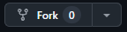

# FSD아키텍처란?

### 🔗[출처](https://emewjin.github.io/feature-sliced-design/?utm_source=substack&utm_medium=email)

`기능 분할 설계(Feature-Sliced Design, FSD)`로,

`레이어(layer), 슬라이스(slice), 세그먼트(segment)`의 세 가지 개념으로 구분된다.


- app: 애플리케이션 로직이 초기화되는 곳입니다. 프로바이더, 라우터, 전역 스타일, 전역 타입 선언 등이 여기에서 정의됩니다. 애플리케이션의 진입점 역할을 합니다.

- processes: 이 레이어는 여러 단계로 이루어진 등록과 같이 여러 페이지에 걸쳐 있는 프로세스를 처리합니다. 이 레이어는 더 이상 사용되지 않는 것으로 간주되지만 여전히 가끔씩 마주할 수 있습니다. 선택적 레이어입니다.

- pages: 이 레이어에는 애플리케이션의 페이지가 포함됩니다.

- widgets: 페이지에 사용되는 독립적인 UI 컴포넌트입니다.

- features: 이 레이어는 비즈니스 가치를 전달하는 사용자 시나리오와 기능을 다룹니다. 예를 들어 좋아요, 리뷰 작성, 제품 평가 등이 있습니다. 선택적 레이어입니다.

- entities: 이 레이어는 비즈니스 엔티티를 나타냅니다. 이러한 엔티티에는 사용자, 리뷰, 댓글 등이 포함될 수 있습니다. 선택적 레이어입니다.

- shared: 이 레이어에는 특정 비즈니스 로직에 종속되지 않은 재사용 가능한 컴포넌트와 유틸리티가 포함되어 있습니다. 여기에는 UI 키트, axios 설정, 애플리케이션 설정, 비즈니스 로직에 묶이지 않은 헬퍼 등이 포함됩니다.

<hr/>
기존에 주로 사용하는 것에 비교하면서 설명하면

- app: `app.tsx`에서 `Provider`로 감싸는 컴포넌트 등을 넣는 폴더

  - `slice`는 Provider, Router, Client와 같은 HOC가 포함됨

- pages: 라우터 등으로 구분되는 페이지를 넣는 폴더

  - `slice`는 각각 주소별 페이지가 slice

- shared: `utils`, `types`, `hooks` 등 공유하는 것들을 넣는 폴더

  - 추가로 공용으로 사용되는 컴포넌트(많이 사용되는 Button같은 것)
  - `feature`의 묶음
  - `slice` 없음

- entities : 컴포넌트 내부가 어떻게 표현될지에 대한 데이터를 표현하는 컴포넌트를 넣는 폴더

  - 데이터가 `slice`
  - `api segment`에서는 데이터를 조회

- widgets : `layout`과 같이 내부 내용은 바뀌지만 전체적인 틀이 비슷한 것들을 넣는 폴더

- process : 예전에는 존재했지만 현재는 안쓴다고 함. (주로 연결되어있는 페이지, 스텝 바이 스텝으로 넘어가는 페이지들을 모아놓음, 이제는 widget으로 넘어감)

- features : `components`에서 컴포넌트가 하는 행위를 넣는 폴더
  - `slice`는 동사
  - `api segment`에서는 해당 행동을 요청

### features와 entities, shared의 차이

위 3개의 폴더는 components 폴더를 나눈 것과 같다.

- features는 `동사`, 그 컴포넌트가 해야되는 행위

- entities는 `명사`, 데이터 그 자체

- shared는 `재사용할 수 있는 UI`

아래 버튼으로 구분하자면



```jsx
<Shared.Button>
 onClick={forcFeature.api.fork}
 icon={shared.icon.fork}
 data={forkEntity.model.forCount}
/>
```

## FSD에서 가장 중요한 점

### 1. 각 import 관계가 명확해야합니다.


- `app 폴더`에서는 아래 6개의 폴더를 import 할 수 있습니다.
- `pages 폴더`에서는 아래 4개의 폴더를 import 할 수 있습니다.

단, 반대의 경우로는 허용되지 않습니다.

### 2. export 하고 싶은 컴포넌트는 index.ts/js를 통해서만 한다.


그럼 외부에서 사용할 때 아래와 같이 import 가 index.ts/js로 통일된다.

```js
import { EachDM } from "shared/index.ts";
```

이렇게 하면 private한 컴포넌트와 public한 컴포넌트를 구분할 수 있다. => `캡슐화`

### 3. 장단점을 잘 구분에서 도입하자

| 장점                                                            | 단점                                                          |
| --------------------------------------------------------------- | ------------------------------------------------------------- |
| 아키텍처 구성 요소를 쉽게 교체, 추가, 제거할 수 있습니다.       | 다른 많은 아키텍처 솔루션들에 비해 높은 진입 장벽이 있습니다. |
| 아키텍처 표준화.                                                | 인식, 팀 문화 및 개념 준수가 필요합니다.                      |
| 확장성.                                                         | 도전 과제와 문제를 나중이 아닌 즉시 해결해야 합니다.          |
| 방법론은 개발 스택과 독립적입니다.                              | 코드 문제와 개념에서 벗어난 부분을 즉시 확인할 수 있습니다.   |
| 예기치 않은 부작용 없이 모듈 간의 연결이 제어되고 명시적입니다. |                                                               |
| 아키텍처 방법론이 비즈니스 지향적입니다.                        |                                                               |

- 중요한 점은 규칙에 대한 이해도가 있어야 하고, 팀원들이 그 규칙을 지켜줘야한다.
- 대규모 프로젝트에서는 효율적이지만 간단한 프로젝트에서는 굳이 사용하지 않아도 된다.
- 아토믹 디자인과 합칠 수 있다.

대표적인 예시를 볼 수 있는 링크가 있다.

### 🔗[FSD아키텍처 예시 어플리케이션](https://nukeapp.netlify.app/)
