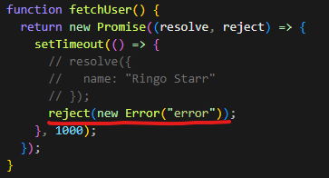

# React에서 Suspense와 Error Boundaries를 함께 사용하여 비동기 데이터 로딩 시 발생할 수 있는 문제를 어떻게 처리할 수 있는지 설명하세요.

## Suspense

Suspense는 개발자가 Loading 상태를 선언적으로 관리할 수 있습니다.

여기서 Loading은 컴포넌트 `Lazy Loading, Data Fetching` 등에 해당됩니다.

그러나 React 팀에서는 Data Fetching에 Suspense를 사용하는 것을 공식적으로 권장하지는 않고 있지만 어떻게 Data Fetching이 가능할까요?

그 이유는 동작 원리에서 알 수 있습니다.

1. render method에서 캐시로부터 값을 읽는다.
2. value가 캐시되어 있으면 정상적으로 render한다.
3. value가 캐시되어 있지 않으면 캐시는 Promise를 throw한다.
4. promise가 resolve되면, React는 Promise를 throw한 곳으로부터 re-render한다.

위 내용처럼 핵심은 "컴포넌트는 Suspense(가장 가까운 Parent에 위치한)에게 Promise를 throw한다는 것",

"데이터가 로딩되고 resolve되면 정상적인 컴포넌트를 render하는 것"입니다.

### 🤔Suspense로 데이터 로딩 상태를 관리할 때 발생할 수 있는 문제점과 해결방법을 말씀해주세요.

1.  로딩 지연:

        - 비동기 요청이 예상보다 오래 걸릴 경우, 사용자는 긴 대기 시간 동안 아무런 피드백을 받지 못하게 됩니다. 이로 인해 사용자 경험이 저하될 수 있습니다.

2.  사용자 경험 저하:

        - 로딩 중 화면이 정지하거나 불확실한 상태가 지속되면 사용자에게 불편함을 초래할 수 있습니다. 특히 긴 로딩 시간은 사용자 이탈로 이어질 수 있습니다.

3.  UI 일관성 문제:

    - 여러 컴포넌트가 동시에 로딩될 때, 각각의 로딩 상태와 결과가 일관되지 않으면 사용자에게 혼란을 줄 수 있습니다.

4.  에러 처리 부족:

    - 데이터 로딩 중 에러가 발생했을 때, 이를 처리할 수 있는 메커니즘이 부족하면 사용자에게 정보가 전달되지 않아 불만을 초래할 수 있습니다.

## ErrorBoundary

Error Boundary가 도입된 배경은 "UI의 일부분에 존재하는 JS 에러가 전체 애플리케이션을 중단시켜서는 안 된다."는 것입니다.

그리하여 에러를 어떤 경계 안에 가두고 정상적인 컴포넌트 대신 fallback UI를 보여주는 React의 컴포넌트입니다.

여기서 핵심은 `getDerivedStateFromError`, `componentDidCatch` 메소드입니다.

```js
class MyErrorBoundary extends React.Component {
  constructor(props) {
    super(props);
    this.state = { hasError: false };
  }

  static getDerivedStateFromError(error) {
    return { hasError: true };
  }

  componentDidCatch(error, errorInfo) {
    // 에러 로깅
  }

  render() {
    if (this.state.hasError) {
      return <h1>Something went wrong.</h1>;
    }

    return this.props.children;
  }
}

// 사용 예
<MyErrorBoundary>
  <Suspense fallback={<div>Loading...</div>}>
    <MyComponent />
  </Suspense>
</MyErrorBoundary>;
```

### 🤔왜 Error Boundary는 class 컴포넌트로만 구현할 수 있을까요?

함수형 컴포넌트, hook은 `컴포넌트의 생명주기 중 이 메소드들을 지원하지 않기 때문`입니다.

- `getDerivedStateFromError`

  - 이 메소드는 정적 메소드로 `하위의 자식 컴포넌트에서 오류가 발생했을 때 호출`됩니다. 주의할 점은 `render 단계에서 호출`되므로, side effects를 발생시키면 안됩니다. 대신 아래에서 말씀드릴 componentDidCatch를 사용하면 됩니다.

- `componentDidCatch`
  - 이 메소드는 commit 단계에서 호출되므로, side effects를 발생시켜도 됩니다. 에러 로그 기록 등에 사용할 수 있습니다.

### 🤔에러바운더리의 주의할점이 무엇인가요?

Error Boundary는 다음과 같은 에러는 포착하지 않습니다.

1. 이벤트 핸들러
2. 비동기 코드
3. SSR
4. 자식이 아닌 Error Boundary 자체에서 발생하는 에러

### 🤔위에서 말하는 주의점에서 우리의 가장 큰 목적은 비동기 코드의 에러를 선언적으로 처리하는 것인데 그럼 어떻게 해결할까요?

먼저 비동기 코드는 (예: setTimeout 혹은 requestAnimationFrame 콜백) 와 같은 것입니다.

API에서 `Promise.reject를 throw`한다면 `Error Boundary에서 에러를 캐치`할 수 있습니다.



data fetching을 위해 suspense와 함께 사용된 wrapPromise으로 `Promise.reject를 throw`하면 Error Boundary에서 비동기 에러를 캐치할 수 있겠다는 생각이 들었습니다.

```js
export function fetchProfileData() {
  let userPromise = fetchUser();
  let postsPromise = fetchPosts();
  return {
    user: wrapPromise(userPromise),
    posts: wrapPromise(postsPromise),
  };
}
// wrapPromise를 만듦
function wrapPromise(promise) {
  let status = "pending";
  let result;
  let suspender = promise.then(
    (r) => {
      status = "success";
      result = r;
    },
    (e) => {
      status = "error";
      result = e;
    }
  );
  return {
    read() {
      if (status === "pending") {
        throw suspender;
      } else if (status === "error") {
        throw result;
      } else if (status === "success") {
        return result;
      }
    },
  };
}

function fetchUser() {
  return new Promise((resolve, reject) => {
    setTimeout(() => {
      // resolve({
      //   name: "Ringo Starr"
      // });
      reject(new Error("error")); // 에러 발생
    }, 1000);
  });
}

function fetchPosts() {
  return new Promise((resolve) => {
    setTimeout(() => {
      resolve([
        {
          id: 0,
          text: "I get by with a little help from my friends",
        },
        {
          id: 1,
          text: "I'd like to be under the sea in an octupus's garden",
        },
        {
          id: 2,
          text: "You got that sand all over your feet",
        },
      ]);
    }, 1100);
  });
}
```

[출처](https://velog.io/@kingyong9169/react-declarative-error-loading-handling)
