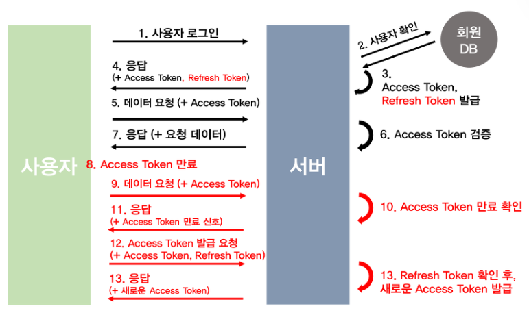

# ✨세션기반인증방식

세션 기반 인증 방식은 `사용자가 로그인하면 서버가 세션을 생성하고, 세션 식별자를 쿠키로 클라이언트에 전송하는 방법`입니다.

클라이언트는 `이후 모든 요청에 이 쿠키를 포함`시켜 서버에 보내며, 서버는 쿠키의 `세션 식별자를 통해 사용자의 인증 상태를 확인`하고 요청을 처리합니다.

이 방식은 `서버가 세션을 관리하므로 보안성이 높지만, 서버의 리소스를 많이 사용하고 확장성이 떨어질 수 있습니다.`

# ✨토큰기반인증방식

토큰 기반 인증 방식은 `사용자가 로그인할 때 생성된 고유한 토큰을 통해 인증을 수행하는 방법`입니다.

사용자가 로그인하면 서버는 사용자 정보를 확인한 후 토큰을 생성하여 클라이언트에 반환하고, 클라이언트는 이후 요청에 이 토큰을 포함시켜 서버에 전송합니다.

서버는 요청에 포함된 `토큰을 검증하여 사용자의 인증 상태를 확인하고 요청을 처리`합니다.

이 방식은 서버가 세션을 유지할 필요가 없고 `확장성이 뛰어나며, 주로 RESTful API와 같은 웹 서비스에서 사용`됩니다.

토큰 관리: 토큰의 만료 및 갱신 관리를 클라이언트 측에서 처리해야 합니다.

토큰 탈취: 토큰이 탈취되면, 만료 기간 동안 악용될 수 있습니다.

### 💡 세션 기반 인증 방식과 토큰 기반 인증 방식의 차이점은 정확히 무엇인가요?

`세션 기반 인증 방식`은

- `서버가 세션을 관리`하고, 세션 ID를 통해 사용자의 상태를 유지합니다.
- 세션 정보는 서버의 `메모리 또는 데이터베이스에 저장`됩니다.
- 서버가 상태를 유지하기 때문에 세션이 만료되거나 로그아웃 시 세션 정보가 제거됩니다.
- 서버가 세션을 관리하기 때문에, `여러 서버에 분산될 경우 세션 정보를 공유해야 하는 복잡성`이 있습니다.

`토큰 기반 인증 방식`은

- 클라이언트가 JWT(JSON Web Token)와 같은 토큰을 저장하고 관리합니다.
- 토큰에는 사용자 정보와 유효 기간 등의 정보가 포함되어 있어, `서버가 별도로 세션 정보를 유지할 필요가 없습니다.`
- 서버가 상태를 유지하지 않기 때문에, `서버 간의 확장성이 좋습니다.` 요청이 들어올 때마다 유효한 토큰만 확인하면 됩니다.
- 모바일 앱, 웹 클라이언트 등 다양한 플랫폼에서 사용 가능하며, API 인증에 적합합니다.

### 세션이 무엇인가요?

세션(Session)은 `웹 애플리케이션에서 사용자의 상태를 관리하기 위한 방법`입니다.

사용자가 웹사이트에 접속하여 특정 작업을 수행할 때, 서버는 그 사용자의 정보를 유지하기 위해 세션을 생성합니다.

### 💡 그렇다면 세션 기반 인증과 토큰 기반 인증은 각각 어느 경우에 적합한가요?

`단일 도메인`이라면 `세션 기반 인증을 사용`하고, 아니라면 `토큰 기반 인증을 사용하는 것이 적합`하다고 생각합니다.

왜? - `세션을 관리할 때 사용되는 쿠키`는 `단일 도메인 및 서브 도메인에서만 작동하도록 설계`되어 있기 때문에 여러 도메인에서 관리하는 것은 어렵습니다. (CORS 문제)

# ✨JWT란?

JWT는 `JSON 형식의 데이터를 사용하여 두 당사자 간에 정보를 안전하게 전송하는 토큰`입니다.

로그인 시 서버가 토큰을 생성하여 클라이언트에 보내고, 클라이언트는 이후 요청에 이 토큰을 포함시켜 서버에 전송합니다.

서버는 토큰을 검증하여 사용자의 인증 상태를 확인합니다.

JWT는 서버가 상태를 유지하지 않아도 되며, 확장성이 뛰어나지만, 토큰이 탈취될 경우 문제가 발생할 수 있습니다.

JWT는 JSON Web Token을 의미하며 `헤더(Header).내용(Payload).서명(Signature)로 구성되며 각 파트를 점(.)으로 구분`합니다.

- 헤더(Header) : `토큰의 타입`과 해시 암호화 알고리즘(방식지정)으로 이루어져 있다.
- 내용(Payload) : 토큰에 사용자가 `담고자 하는 정보`를 담는다. 내용에는 Claim이 담겨있고, `JSON(Key/Value)형태의 한 쌍`으로 이루어져 있다.
- 서명(Signature) : 토큰을 인코딩하거나 유효성 검증할 때 사용하는 고유한 `암호화 코드`이다. 헤더와 내용의 값을 인코딩한다.

### 장점

1. 사용자 인증에 필요한 모든 정보는 토큰 자체에 포함하기 때문에 `별도의 인증 저장소가 필요 없습니다.`

2. 다른 유형의 토큰과 비교했을 때 `경량화`되어있습니다. SAML(Security Assertion Markup Language Tokens)이란 토큰이 있지만 이에 비해 훨씬 경량화되어있음.

3. 디코딩했을 때 `JSON이 나오기 때문`에 JSON을 기반으로 `쉽게 직렬화, 역직렬화가 가능`하다.

### 단점

1. 토큰이 비대해질 경우 당연히 `서버과부화에 영향`을 줄 수 있습니다. (JWT 자체도 길이가 길어서 트래픽 낭비 문제가 있음)

2. 토큰을 `탈취`당할 경우 디코딩했을 때 데이터를 볼 수 있습니다. (페이로드는 암호화된 게 아니라서 누구나 다 열어볼 수 있음)

- 토큰기반인증방식을 구현할 때는 refresh토큰과 access토큰 두개를 기반으로 구현합니다.

- access토큰의 수명은 짧게, refresh토큰의 수명은 길게 합니다.

### 주의할 점

이렇게 access토큰을 얻었다면 그 이후에 요청을 할 때는 HTTP Header - Authorization 또는 HTTP Header - Cookie에 담아 요청을 하게 되는데요. 이 때 다음과 같은 규칙을 지키는 것이 좋습니다.

- Bearer 으로 Bearer 을 앞에 둬서 토큰기반인증방식이라는 것을 알려주어야 합니다.

- https를 사용해야 합니다.

- 쿠키에 저장한다면 sameSite: 'Strict'을 써야 합니다.

- 수명이 짧은 access token을 발급해야 합니다.

- url에 토큰을 전달하지 말아야 합니다

참고로 이러한 점들은 OAuth2.0과 JWT에 관한 표준문서인 RFC 6750, RFC7519를 기반으로 설명합니다.

### 액세스 토큰과 리프레시 토큰을 설명해주세요.

사용자가 인증을 마치면 서버에서 `액세스 토큰`을 서버에서 발급해주는데

이 액세스 토큰을 사용하면 앞으로 서버에 API 요청을 할 떄

이 액세스 토큰을 같이 넣어서 보내면 `사용자를 인증`할 수가 있습니다.

그런데 액세스 토큰을 탈취당하면 사용자를 도용해서 사용할 수 있기 때문에 `수명을 짧게 가져가는 것이 중요`하고,

세션 스토리지에 저장할 수도 있지만 메모리에 저장하는 것을 권장하고 있습니다.

`메모리에 저장한다는 것은 자바스크립트 변수나 객체를 의미합니다. 전역 변수 x`

이는 XSS,CSRF 공격에 대비가 가능합니다.

예를 들면 처음에 로그인을 했을 때, 서버는 로그인을 성공시키면서 클라이언트에게 `Access Token과 Refresh Token을 동시에 발급`한다.

서버는 `데이터베이스에 Refresh Token을 저장`하고, 클라이언트는 `Access Token과 Refresh Token`을 쿠키, 세션 혹은 웹스토리지에 저장하고 요청이 있을때마다 이 둘을 `헤더`에 담아서 보낸다.

이 Refresh Token은 긴 유효기간을 가지면서, Access Token이 만료됐을 때 새로 재발급해주는 열쇠가 된다.

따라서 만일 `만료된 Access Token`을 서버에 보내면, 서버는 같이 보내진 `Refresh Token을  DB에 있는 것과 비교해서 일치`하면 다시 `Access Token을 재발급`하는 간단한 원리이다.

그리고 사용자가 `로그아웃`을 하면 `저장소에서 Refresh Token을 삭제`하여 사용이 불가능하도록 하고 새로 로그인하면 서버에서 다시 재발급해서 DB에 저장한다

 

보통 액세스 토큰의 수명이 짧기 때문에 계속해서 재발급을 해줘야 하는데 이 때 `리프레쉬 토큰`이 필요합니다.

리프레쉬 토큰은 주로 HTTPOnly strict Cookie에 저장합니다.

리프레쉬 토큰은 액세스 토큰에 비해 수명이 깁니다.

액세스 토큰과 리프레시 토큰을 나누는 이유는 주로 보안과 효율성을 높이기 위해서입니다.

### 1. 보안 강화

- 짧은 유효 기간: 액세스 토큰은 짧은 유효 기간을 가지므로, 만약 유출되더라도 피해를 최소화할 수 있습니다.
  - 사용자가 `자주 로그인을 요구받지 않도록 리프레시 토큰을 사용해 새로운 액세스 토큰을 발급받을 수 있습니다.`
- 리프레시 토큰 보호: 리프레시 토큰은 더 긴 유효 기간을 가지며, `일반적으로 서버 측에서 안전하게 저장`되기 때문에, 공격자가 쉽게 접근하기 어렵습니다.

### 2. 사용자 경험 향상

- 원활한 세션 유지: 사용자가 액세스 토큰이 만료되었을 때 자동으로 리프레시 토큰을 사용하여 새로운 액세스 토큰을 발급받음으로써, `사용자는 로그인 과정을 반복하지 않고도 서비스를 지속적으로 이용`할 수 있습니다.

### 3. 서버 부하 감소

- 효율적인 토큰 관리: 액세스 토큰의 유효 기간이 짧고, 리프레시 토큰을 통해 새로운 액세스 토큰을 발급받는 방식은 `서버의 부하를 줄이고, 불필요한 로그인 요청을 감소`시킵니다.

### 4. 권한 관리

- 세분화된 권한 설정: 액세스 토큰과 리프레시 토큰을 분리함으로써, 각 토큰에 대해 서로 다른 권한을 설정할 수 있습니다. 예를 들어, 리프레시 토큰은 특정한 권한을 부여하지 않을 수 있습니다.
